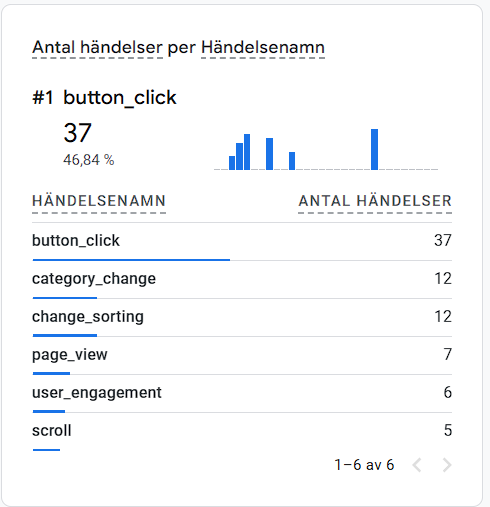

# u04-Webbshoppen

## Möjligheter med händelsespårning
Gtag är väldigt användbart för att spåra relevant information om kunder och användares besök på hemsidan. Där kan man på ett enkelt sätt placera en tracker som känner av knapptryck och andra interaktioner  sidan. Detta gör att man kan fokusera på produkter och annonser efter den ens data-insamling. Utöver interaktioner så går det även att få information om sidans intäkter.

Det är hjälpsamt för att förstå trender som pågår på ens webbplats genom att följa användares knapptryck och rörelser. Custom events kan spåra personliga och komplexa analyser som att se om en användare stannate sidan i över 5 minuter. Det går också att spåra flera steg i t.ex registreringar genom att använda custom events, dett generar då en specific analys av hur användare interagerar med webbplatsen.

Målgrupp är väldigt viktigt i att skapa en sida som passar användarna, via google analytics kan man även se vilka breakpoints användarna använder och därifrån förstå om sidan används mer på telefon eller datorn, samt kunna se vilket land som oftast använder sidan för att kunna översätta sidan efter behov.

## Begränsningar

Händelsespårning kräver korrekt implementering. Om spårningen inte genomförs på rätt sätt kan det leda till dubbelspårning, felaktig data eller tekniska problem, till exempel om gtag inte är korrekt inkluderad i JavaScript-koden.
En annan begränsning är att händelserna inte alltid registreras korrekt om användaren snabbt lämnar sidan eller om JavaScript inte laddas in på rätt sätt. Realtidsrapporter visar dessutom endast data från de senaste 30 minuterna, vilket innebär att en djupare analys av detaljer kan kräva längre väntetid.
Det är också viktigt att händelsespårningen följer integritetslagar, såsom GDPR. Det är inte tillåtet att skicka personligt identifierbar information, som namn eller e-postadresser, direkt i händelser.

## Custom gtags
Vi har placerat 3 olika custom gtags som alla 3 informerar angående knapptryck. 
 “button_click" - knapp tryck på “Pay now
“category_change” - knapp tryck på de olika kategorierna alternativen
“change_sorting” - knapp tryck på de olika sorterings alternativen(rating/price)

